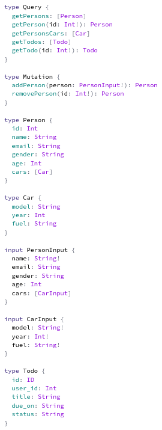

# GraphQL Demo

#### Description

Application developed to serve as a proof of concept for the implementation of a **GraphQL** server.

Developed using **Node.js**, **apollo-server** and **graphql-tools**.

The server offers operations (*Queries* and *Mutations*) on two different "*schemas*":
* Persons
    * Using an array and interaction with it to simulate the access to a database ([this array](src/datasources/persons-db.js))
    * Operations:
        * Get the full list of persons (**getPersons** query)
        * Get a specific person (**getPerson** query)
        * Get the list of cars of all the persons (**getPersonsCars** query)
        * Add a person (**addPerson** mutation)
        * Remove a person (**removePerson** mutation)
* Todos
    * Using `https://gorest.co.in/public/v2/todos` and `https://gorest.co.in/public/v2/todos/${id}` endpoints
    * Operations:
        * Get the full list of todos (**getTodos** query)
        * Get a specific todo (**getTodo** query)

You can use [this](queries.graphql) queries as an example to interact with the server with [this](queries-variables.json) variables.

**Full Schema**:
<br>


#### Setup

* Install dependencies
```
$ npm install
```
* Run the application
```
$ npm start
```
* Open `http://localhost:4000` on the browser and start querying the server on Apollo GraphQL Studio.